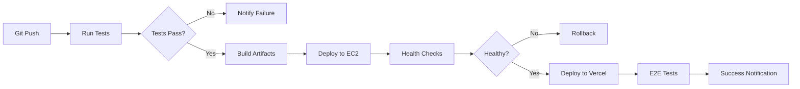

# Architecture de Déploiement RT-Technologie

## Vue d'ensemble

RT-Technologie est une plateforme logistique SaaS multi-tenant déployée sur une infrastructure hybride :
- **Backend Services** : AWS EC2 (17 microservices Node.js)
- **Base de données** : MongoDB Atlas (multi-région)
- **Frontend** : Vercel (9 applications Next.js + PWA)
- **Fichiers** : AWS S3 + CloudFront CDN
- **DNS** : Route53

## Architecture Cible (Production)

```
┌─────────────────────────────────────────────────────────────────────────────┐
│                            INTERNET (UTILISATEURS)                           │
└─────────────────────────────────────────────────────────────────────────────┘
                                      │
                ┌─────────────────────┴─────────────────────┐
                │                                             │
                ▼                                             ▼
┌───────────────────────────────┐         ┌──────────────────────────────────┐
│      Route53 (DNS)            │         │      CloudFront (CDN)            │
│  *.rt-technologie.com         │         │  Static Assets + S3              │
└───────────────┬───────────────┘         └──────────────────────────────────┘
                │                                             │
                ▼                                             ▼
┌───────────────────────────────┐         ┌──────────────────────────────────┐
│  Application Load Balancer    │         │      Vercel Edge Network         │
│  (ALB - Port 80/443)          │         │  9 Next.js Apps + PWA            │
│  SSL/TLS Termination          │         │  - web-industry (3010)           │
└───────────┬───────────────────┘         │  - web-transporter (3100)        │
            │                             │  - web-logistician (3106)        │
            │                             │  - web-forwarder                 │
            ▼                             │  - web-supplier                  │
┌─────────────────────────────────────┐   │  - web-recipient                 │
│     Target Group (Health Checks)    │   │  - backoffice-admin              │
│     Auto Scaling Group (2-10)       │   │  - mobile-driver/pwa             │
└───────────┬─────────────────────────┘   │  - kiosk                         │
            │                             └──────────────────────────────────┘
            ▼
┌─────────────────────────────────────────────────────────────────────────────┐
│                  VPC (eu-west-3 - Paris)                                     │
│  ┌─────────────────────────────────────────────────────────────────────┐    │
│  │                   Public Subnet (AZ-A)                              │    │
│  │  ┌──────────────────────────────────────────────────────────────┐   │    │
│  │  │  EC2 Instance (t3.medium) - Services Backend (PM2)           │   │    │
│  │  │  ─────────────────────────────────────────────────────────   │   │    │
│  │  │  1. admin-gateway        :3008                               │   │    │
│  │  │  2. authz                :3007                               │   │    │
│  │  │  3. core-orders          :3001                               │   │    │
│  │  │  4. notifications        :3002                               │   │    │
│  │  │  5. planning             :3004                               │   │    │
│  │  │  6. tms-sync             :3003                               │   │    │
│  │  │  7. ecpmr                :3009                               │   │    │
│  │  │  8. vigilance            :3006                               │   │    │
│  │  │  9. palette              :3011                               │   │    │
│  │  │  10. affret-ia           :3005                               │   │    │
│  │  │  11. training            :3012                               │   │    │
│  │  │  12. storage-market      :3013                               │   │    │
│  │  │  13. pricing-grids       :3014                               │   │    │
│  │  │  14. tracking-ia         :3015                               │   │    │
│  │  │  15. bourse              :3016                               │   │    │
│  │  │  16. wms-sync            :3017                               │   │    │
│  │  │  17. erp-sync            :3018                               │   │    │
│  │  └──────────────────────────────────────────────────────────────┘   │    │
│  └─────────────────────────────────────────────────────────────────────┘    │
│                                                                              │
│  ┌─────────────────────────────────────────────────────────────────────┐    │
│  │                   Public Subnet (AZ-B)                              │    │
│  │  ┌──────────────────────────────────────────────────────────────┐   │    │
│  │  │  EC2 Instance (t3.medium) - Services Backend (PM2)           │   │    │
│  │  │  (Replica pour HA - même configuration)                      │   │    │
│  │  └──────────────────────────────────────────────────────────────┘   │    │
│  └─────────────────────────────────────────────────────────────────────┘    │
│                                                                              │
│  ┌─────────────────────────────────────────────────────────────────────┐    │
│  │                   Private Subnet (AZ-A + AZ-B)                      │    │
│  │  ┌────────────────────────────────┐                                 │    │
│  │  │  RDS PostgreSQL (si nécessaire)│                                 │    │
│  │  │  db.t3.micro                   │                                 │    │
│  │  │  Multi-AZ (HA)                 │                                 │    │
│  │  └────────────────────────────────┘                                 │    │
│  └─────────────────────────────────────────────────────────────────────┘    │
│                                                                              │
│  Security Groups:                                                            │
│  - ALB-SG: 80, 443 from 0.0.0.0/0                                            │
│  - EC2-SG: 3001-3018 from ALB-SG                                             │
│  - RDS-SG: 5432 from EC2-SG                                                  │
└─────────────────────────────────────────────────────────────────────────────┘
                                      │
                                      ▼
┌─────────────────────────────────────────────────────────────────────────────┐
│                    MongoDB Atlas (eu-west-3)                                 │
│  ┌─────────────────────────────────────────────────────────────────────┐    │
│  │  Cluster: rt-production (M10 - General Purpose)                     │    │
│  │  - Replica Set 3 nodes (Multi-région: Paris + Frankfurt + Londres)  │    │
│  │  - Auto-scaling: Storage 10GB → 500GB                               │    │
│  │  - Backup: Continuous (Point-in-time recovery)                      │    │
│  │  - Databases: rt-production                                         │    │
│  │    Collections: organizations, users, orders, carriers, etc.        │    │
│  └─────────────────────────────────────────────────────────────────────┘    │
└─────────────────────────────────────────────────────────────────────────────┘
                                      │
                                      ▼
┌─────────────────────────────────────────────────────────────────────────────┐
│                    AWS Services Complémentaires                              │
│  - S3 Buckets:                                                               │
│    * rt-prod-documents (CMR, factures, contrats)                            │
│    * rt-prod-images (photos palettes, profils)                              │
│    * rt-prod-backups (sauvegardes MongoDB, logs)                            │
│  - CloudWatch: Logs, Metrics, Alarms                                         │
│  - SNS: Alertes (email, SMS)                                                 │
│  - IAM: Roles, Policies                                                      │
│  - Secrets Manager: Clés API, tokens                                         │
│  - SES: Envoi emails (backup Mailgun)                                        │
└─────────────────────────────────────────────────────────────────────────────┘
```

## Services Backend (17 microservices)

### Services Core (API Gateway)
| Service | Port | Responsabilité | Dépendances |
|---------|------|----------------|-------------|
| **admin-gateway** | 3008 | API Gateway admin, health checks | authz, core-orders, notifications |
| **authz** | 3007 | Authentification, autorisation, JWT | MongoDB, Mailgun |
| **core-orders** | 3001 | Gestion des commandes TMS | MongoDB, S3 |

### Services Métier
| Service | Port | Responsabilité | Dépendances |
|---------|------|----------------|-------------|
| **notifications** | 3002 | Envoi emails (Mailgun/SES) | Mailgun, AWS SES |
| **planning** | 3004 | Gestion planning transporteurs | MongoDB |
| **tms-sync** | 3003 | Synchronisation TMS externes | core-orders |
| **ecpmr** | 3009 | Gestion eCMR (documents) | S3, MongoDB |
| **vigilance** | 3006 | Validation VAT transporteurs | VAT API |
| **palette** | 3011 | Gestion palettes consignées | MongoDB, S3 |
| **affret-ia** | 3005 | Matching AI affréteurs | OpenRouter, MongoDB |
| **training** | 3012 | Formation utilisateurs (LMS) | MongoDB |
| **storage-market** | 3013 | Marketplace stockage | MongoDB |

### Services Intégration
| Service | Port | Responsabilité | Dépendances |
|---------|------|----------------|-------------|
| **pricing-grids** | 3014 | Grilles tarifaires | MongoDB |
| **tracking-ia** | 3015 | Tracking GPS + prédictions | MongoDB |
| **bourse** | 3016 | Bourse de fret | MongoDB |
| **wms-sync** | 3017 | Sync WMS (entrepôts) | MongoDB |
| **erp-sync** | 3018 | Sync ERP clients | MongoDB |

## Applications Frontend (9 apps)

| Application | Port Dev | URL Production | Responsabilité |
|-------------|----------|----------------|----------------|
| **web-industry** | 3010 | industry.rt-technologie.com | Portail chargeurs/industriels |
| **web-transporter** | 3100 | transporter.rt-technologie.com | Portail transporteurs |
| **web-logistician** | 3106 | logistician.rt-technologie.com | Portail logisticiens |
| **web-forwarder** | - | forwarder.rt-technologie.com | Portail affréteurs |
| **web-supplier** | - | supplier.rt-technologie.com | Portail fournisseurs |
| **web-recipient** | - | recipient.rt-technologie.com | Portail destinataires |
| **backoffice-admin** | - | admin.rt-technologie.com | Backoffice administration |
| **mobile-driver/pwa** | - | driver.rt-technologie.com | PWA chauffeurs mobile |
| **kiosk** | - | kiosk.rt-technologie.com | Kiosk mode (tablettes) |

## Infrastructure AWS

### Ressources EC2

#### Instance Type
- **Production** : `t3.medium` (2 vCPU, 4GB RAM)
- **Staging** : `t3.small` (2 vCPU, 2GB RAM)
- **Dev** : `t3.micro` (2 vCPU, 1GB RAM)

#### Auto Scaling
- **Min instances** : 2 (HA)
- **Max instances** : 10 (charge)
- **Scaling policy** : CPU > 70% → +1 instance

#### AMI
- **OS** : Amazon Linux 2023
- **Pre-installed** : Node.js 20, PM2, Docker, Git

### Application Load Balancer (ALB)

```yaml
Scheme: internet-facing
Listeners:
  - Port: 443 (HTTPS)
    Protocol: HTTPS
    Certificate: ACM (*.rt-technologie.com)
    Default Action: Forward to Target Group
  - Port: 80 (HTTP)
    Protocol: HTTP
    Default Action: Redirect to HTTPS

Target Groups:
  - admin-gateway: /admin/* → EC2:3008
  - authz: /auth/* → EC2:3007
  - core-orders: /api/orders/* → EC2:3001
  - notifications: /api/notifications/* → EC2:3002
  - planning: /api/planning/* → EC2:3004
  - tms-sync: /api/tms/* → EC2:3003
  - ecpmr: /api/ecpmr/* → EC2:3009
  - vigilance: /api/vigilance/* → EC2:3006
  - palette: /api/palettes/* → EC2:3011
  - affret-ia: /api/affret/* → EC2:3005
  - training: /api/training/* → EC2:3012
  - storage-market: /api/storage/* → EC2:3013

Health Check:
  - Path: /health
  - Interval: 30s
  - Timeout: 5s
  - Healthy threshold: 2
  - Unhealthy threshold: 3
```

### VPC Configuration

```yaml
CIDR: 10.0.0.0/16

Subnets:
  Public (AZ-A): 10.0.1.0/24
  Public (AZ-B): 10.0.2.0/24
  Private (AZ-A): 10.0.10.0/24
  Private (AZ-B): 10.0.11.0/24

Internet Gateway: igw-rt-prod
NAT Gateway:
  - nat-az-a (EIP)
  - nat-az-b (EIP)

Route Tables:
  - Public: 0.0.0.0/0 → IGW
  - Private: 0.0.0.0/0 → NAT
```

### Security Groups

```yaml
ALB-SG:
  Inbound:
    - Port: 443, Source: 0.0.0.0/0 (HTTPS public)
    - Port: 80, Source: 0.0.0.0/0 (HTTP redirect)
  Outbound:
    - All traffic

EC2-Backend-SG:
  Inbound:
    - Port: 3001-3018, Source: ALB-SG (Services)
    - Port: 22, Source: Bastion-SG (SSH admin)
  Outbound:
    - All traffic (MongoDB Atlas, APIs externes)

RDS-SG:
  Inbound:
    - Port: 5432, Source: EC2-Backend-SG (PostgreSQL)
  Outbound:
    - None

Bastion-SG:
  Inbound:
    - Port: 22, Source: VPN-IP (SSH sécurisé)
  Outbound:
    - All traffic
```

### S3 Buckets

```yaml
rt-prod-documents:
  Purpose: CMR, factures, contrats PDF
  Versioning: Enabled
  Encryption: AES-256
  Lifecycle:
    - Archive to Glacier after 90 days
    - Delete after 7 years (compliance)
  CloudFront: cdn-docs.rt-technologie.com

rt-prod-images:
  Purpose: Photos palettes, avatars
  Versioning: Disabled
  Encryption: AES-256
  CloudFront: cdn-img.rt-technologie.com
  Max file size: 10MB

rt-prod-backups:
  Purpose: Backups MongoDB, logs
  Versioning: Enabled
  Lifecycle:
    - Archive to Glacier after 30 days
    - Delete after 365 days
  Access: Private (IAM only)
```

### CloudFront CDN

```yaml
cdn-docs.rt-technologie.com:
  Origin: rt-prod-documents.s3.eu-west-3.amazonaws.com
  Behavior:
    - Cache TTL: 86400 (1 day)
    - HTTPS Only
    - Signed URLs (private documents)

cdn-img.rt-technologie.com:
  Origin: rt-prod-images.s3.eu-west-3.amazonaws.com
  Behavior:
    - Cache TTL: 604800 (7 days)
    - HTTPS Only
    - Image optimization
```

### RDS PostgreSQL (Optionnel)

```yaml
Instance: db.t3.micro
Engine: PostgreSQL 15.x
Storage: 20GB SSD (auto-scaling → 100GB)
Multi-AZ: Yes (HA)
Backup: Automated daily (7 days retention)
Encryption: At rest + in transit

Databases:
  - rt_analytics (si besoin reporting)
```

### IAM Roles & Policies

```yaml
EC2-Backend-Role:
  Policies:
    - S3 Read/Write (rt-prod-*)
    - SES Send Email
    - CloudWatch Logs Write
    - Secrets Manager Read

Github-Actions-Role:
  Policies:
    - EC2 Describe/Start/Stop
    - S3 Deploy artifacts
    - CodeDeploy Trigger

Monitoring-Role:
  Policies:
    - CloudWatch Read
    - EC2 Describe
```

## MongoDB Atlas Configuration

### Clusters

```yaml
Development:
  Name: rt-dev
  Tier: M0 (Free)
  Region: AWS eu-west-3 (Paris)
  Nodes: 1
  Storage: 512MB

Staging:
  Name: rt-staging
  Tier: M2 (Shared)
  Region: AWS eu-west-3 (Paris)
  Nodes: 3 (Replica Set)
  Storage: 2GB
  Backup: Daily snapshots (7 days)

Production:
  Name: rt-production
  Tier: M10 (General Purpose)
  Regions:
    - Primary: AWS eu-west-3 (Paris)
    - Secondary: AWS eu-central-1 (Frankfurt)
    - Secondary: AWS eu-west-2 (London)
  Nodes: 3 (Multi-region Replica Set)
  Storage: 10GB → Auto-scaling to 500GB
  IOPS: 3000
  Backup:
    - Continuous (Point-in-time recovery)
    - Daily snapshots (30 days retention)
    - Monthly archives (1 year)
```

### Database Users

```yaml
app_user:
  Roles:
    - Database: rt-production
      Role: readWrite
  Scopes: All collections
  IP Whitelist: EC2 Security Group IPs

admin_user:
  Roles:
    - Database: admin
      Role: dbAdminAnyDatabase
  Scopes: All databases
  IP Whitelist: VPN IP + Bastion

backup_user:
  Roles:
    - Database: rt-production
      Role: backup
  Scopes: Backup operations only
```

### Network Access

```yaml
IP Access List:
  Production:
    - EC2 NAT Gateway IPs (auto-updated via Terraform)
    - Github Actions IP range
    - VPN IP (admin access)
    - 0.0.0.0/0 (temporaire dev, à restreindre)

VPC Peering:
  Enabled: Yes
  Peer VPC: vpc-rt-prod (eu-west-3)
  CIDR: 10.0.0.0/16
```

### Performance & Monitoring

```yaml
Performance Advisor: Enabled
Real-time Monitoring: Enabled
Query Profiler: Enabled (slow queries > 100ms)

Alerts:
  - CPU > 80% → Email + SMS
  - Disk > 85% → Email
  - Connections > 500 → Email
  - Replication lag > 10s → PagerDuty
```

## Vercel Configuration

### Projects

```yaml
web-industry:
  Framework: Next.js 14
  Build Command: pnpm build
  Output Directory: .next
  Install Command: pnpm install
  Root Directory: apps/web-industry
  Environment Variables: NEXT_PUBLIC_*, API URLs

web-transporter:
  Framework: Next.js 14
  Root Directory: apps/web-transporter
  (même config)

# ... (8 autres apps similaires)
```

### Environment Variables (Vercel)

```bash
# Production
NEXT_PUBLIC_ADMIN_GATEWAY_URL=https://api.rt-technologie.com
NEXT_PUBLIC_AUTHZ_URL=https://auth.rt-technologie.com
NEXT_PUBLIC_SUPPORT_URL=https://support.rt-technologie.com

# Preview (branches)
NEXT_PUBLIC_ADMIN_GATEWAY_URL=https://api-staging.rt-technologie.com
```

### Domains

```yaml
web-industry:
  Production: industry.rt-technologie.com
  Preview: industry-*.vercel.app

web-transporter:
  Production: transporter.rt-technologie.com
  Preview: transporter-*.vercel.app

# ... etc.
```

### Edge Functions (si besoin)

```yaml
Middleware:
  - Authentication check
  - Geo-blocking (EU only)
  - Rate limiting
  - A/B testing
```

## DNS Configuration (Route53)

### Hosted Zone

```yaml
Domain: rt-technologie.com

Records:
  # Backend API (ALB)
  - api.rt-technologie.com → ALB (A record, Alias)
  - auth.rt-technologie.com → ALB (A record, Alias)

  # Services individuels (pour debug)
  - admin-gateway.rt-technologie.com → ALB:3008
  - core-orders.rt-technologie.com → ALB:3001
  - notifications.rt-technologie.com → ALB:3002
  # ... (tous les services)

  # Frontend (Vercel)
  - industry.rt-technologie.com → CNAME → cname.vercel-dns.com
  - transporter.rt-technologie.com → CNAME → cname.vercel-dns.com
  # ... (toutes les apps)

  # CDN
  - cdn-docs.rt-technologie.com → CloudFront (A record, Alias)
  - cdn-img.rt-technologie.com → CloudFront (A record, Alias)

  # Email
  - @ → MX → mailgun.org (priority 10)
  - _dmarc → TXT → v=DMARC1; p=quarantine
  - default._domainkey → TXT → (DKIM key)
```

## SSL/TLS Certificates

### AWS Certificate Manager (ACM)

```yaml
Certificate 1:
  Domain: *.rt-technologie.com
  Validation: DNS (Route53)
  Usage: ALB, CloudFront
  Auto-renewal: Yes

Certificate 2:
  Domain: rt-technologie.com
  Subject Alternative Names:
    - www.rt-technologie.com
  Validation: DNS
  Usage: CloudFront
```

### Vercel SSL

```yaml
Auto-provisioned: Yes
Provider: Let's Encrypt
Renewal: Automatic
Custom Domains: Supported
```

## CI/CD Pipeline (GitHub Actions)

### Workflow Principal

```yaml
Triggers:
  - push to main → Deploy Production
  - push to staging → Deploy Staging
  - pull_request → Deploy Preview

Jobs:
  1. Lint & Test (all workspaces)
  2. Build Backend (services/*)
  3. Build Frontend (apps/*)
  4. Deploy Backend to AWS EC2
  5. Deploy Frontend to Vercel
  6. Run E2E tests
  7. Notify (Slack, Discord)
```

### Deployment Steps



## Variables d'Environnement

### Services Backend (.env)

```bash
# Node.js
NODE_ENV=production
PORT=auto (3001-3018)

# MongoDB Atlas
MONGODB_URI=mongodb+srv://app_user:<password>@rt-production.xxxxx.mongodb.net
MONGODB_DB=rt-production
MONGODB_ATLAS_PUBLIC_KEY=<atlas-api-key>
MONGODB_ATLAS_PRIVATE_KEY=<atlas-api-secret>

# AWS
AWS_REGION=eu-west-3
AWS_S3_BUCKET_DOCS=rt-prod-documents
AWS_S3_BUCKET_IMAGES=rt-prod-images
AWS_SES_REGION=eu-west-1

# Security
JWT_SECRET=<strong-secret-256-bits>
INTERNAL_SERVICE_TOKEN=<strong-token>
SECURITY_ENFORCE=true

# APIs externes
MAILGUN_API_KEY=<mailgun-key>
MAILGUN_DOMAIN=mg.rt-technologie.com
OPENROUTER_API_KEY=<openrouter-key>
VATCHECK_API_KEY=<vatcheck-key>

# URLs Services (internes ALB)
ADMIN_GATEWAY_URL=http://10.0.1.10:3008
AUTHZ_URL=http://10.0.1.10:3007
CORE_ORDERS_URL=http://10.0.1.10:3001
# ... etc.

# URLs publiques (pour callbacks)
PUBLIC_API_URL=https://api.rt-technologie.com
CORS_ALLOW_ORIGIN=https://industry.rt-technologie.com,https://transporter.rt-technologie.com
```

### Frontend Vercel (.env.production)

```bash
# Public (exposées au client)
NEXT_PUBLIC_ADMIN_GATEWAY_URL=https://api.rt-technologie.com
NEXT_PUBLIC_AUTHZ_URL=https://auth.rt-technologie.com
NEXT_PUBLIC_SUPPORT_URL=https://support.rt-technologie.com
NEXT_PUBLIC_CDN_DOCS=https://cdn-docs.rt-technologie.com
NEXT_PUBLIC_CDN_IMAGES=https://cdn-img.rt-technologie.com

# Server-only
API_SECRET_KEY=<secret>
```

## Monitoring & Observability

### CloudWatch

```yaml
Log Groups:
  - /aws/ec2/rt-backend (tous les services)
  - /aws/alb/rt-production
  - /aws/rds/rt-production

Metrics:
  - CPU Utilization (EC2, RDS)
  - Network In/Out
  - Request Count (ALB)
  - Latency (ALB)
  - Error Rate (4xx, 5xx)
  - Disk Usage

Alarms:
  - CPU > 80% pour 5 min → SNS → Email
  - Error Rate > 5% → PagerDuty
  - Disk > 90% → SNS
  - ALB Unhealthy Targets > 0 → PagerDuty
```

### Application Performance Monitoring (APM)

**Options recommandées** :
- **DataDog** : Full-stack observability
- **New Relic** : APM + Infrastructure
- **AWS X-Ray** : Distributed tracing

```yaml
DataDog Agent:
  Install: EC2 instances
  Metrics: System + Custom (business KPIs)
  Logs: Aggregation + Search
  APM: Node.js tracing
  Dashboards:
    - Services Health
    - Business Metrics (orders/day, revenue)
    - Error tracking
```

### MongoDB Atlas Monitoring

```yaml
Built-in Metrics:
  - Query Performance
  - Index Usage
  - Replication Lag
  - Connection Pool
  - Disk IOPS

Alerts:
  - CPU > 80% → Email
  - Replication Lag > 10s → PagerDuty
  - Disk > 85% → Email + Auto-scale
```

## Backup & Disaster Recovery

### MongoDB Atlas

```yaml
Backup Strategy:
  - Continuous Backup (Point-in-time recovery)
  - Snapshot Schedule: Every 6 hours
  - Retention: 30 days (snapshots), 1 year (monthly)
  - Cross-region replication: Yes (Paris → Frankfurt)

Recovery Procedures:
  - RTO: 1 hour (Recovery Time Objective)
  - RPO: 15 minutes (Recovery Point Objective)
  - Test: Monthly DR drill
```

### S3 Buckets

```yaml
Versioning: Enabled (all buckets)
Cross-Region Replication:
  - Source: rt-prod-documents (eu-west-3)
  - Destination: rt-backup-documents (eu-west-1)

Lifecycle:
  - Current versions: Keep 90 days
  - Non-current versions: Archive to Glacier after 30 days
```

### EC2 / Application State

```yaml
AMI Snapshots:
  - Frequency: Weekly
  - Retention: 4 weeks
  - Automated: AWS Backup

Code Deployment:
  - Git Tags: Every release
  - Docker Images: Stored in ECR
  - Rollback: Previous version in 5 min
```

## Sécurité

### Network Security

```yaml
VPC:
  - Private subnets pour données sensibles
  - NAT Gateway pour outbound seulement
  - Security Groups: Least privilege
  - NACLs: Deny malicious IPs

WAF (Web Application Firewall):
  - Protect ALB
  - Rules:
    - Block SQL injection
    - Block XSS
    - Rate limiting (1000 req/min/IP)
    - Geo-blocking (non-EU)
```

### Application Security

```yaml
Authentication:
  - JWT avec expiration (1h access, 7d refresh)
  - Password: bcrypt (12 rounds)
  - MFA: TOTP (optionnel)

Authorization:
  - RBAC (Role-Based Access Control)
  - Scopes: read, write, admin
  - API Keys pour services

API Security:
  - Rate limiting (100 req/min/user)
  - CORS strict
  - HTTPS only (HSTS)
  - Input validation (Zod)
  - SQL/NoSQL injection protection
```

### Data Security

```yaml
Encryption at Rest:
  - MongoDB: AES-256
  - S3: SSE-S3 (AES-256)
  - RDS: AES-256
  - EBS: AES-256

Encryption in Transit:
  - TLS 1.3 (public endpoints)
  - TLS 1.2+ (internal services)
  - Certificate pinning (mobile apps)

Secrets Management:
  - AWS Secrets Manager (production keys)
  - .env local development only
  - No secrets in Git (pre-commit hook)
```

### Compliance

```yaml
RGPD:
  - Data residency: EU only
  - Right to erasure: Implemented
  - Consent management: Opt-in
  - DPO: Assigned

Logging:
  - Access logs: 1 year retention
  - Audit trail: All admin actions
  - PII anonymization in logs
```

## Coûts Estimés (Mensuel)

### AWS

```yaml
EC2:
  - 2x t3.medium (prod): $60
  - 1x t3.small (staging): $15
  - Reserved Instances (1 year): -30%
  Total: $52

ALB:
  - Load Balancer: $22
  - LCU (Load Balancer Capacity Units): $15
  Total: $37

S3:
  - Storage (50GB): $1.15
  - Requests: $5
  - Data Transfer: $10
  Total: $16

CloudFront:
  - Data Transfer (100GB): $8.50
  - Requests: $1
  Total: $9.50

RDS (optionnel):
  - db.t3.micro: $15
  Total: $15

Route53:
  - Hosted Zone: $0.50
  - Queries (1M): $0.40
  Total: $1

CloudWatch:
  - Logs (10GB): $5
  - Metrics: $3
  Total: $8

TOTAL AWS: ~$138/mois
```

### MongoDB Atlas

```yaml
Production (M10):
  - Cluster: $57/mois
  - Backup: $10/mois
  - Data Transfer: $5/mois
  Total: $72/mois

Staging (M2):
  - Cluster: $9/mois
  Total: $9/mois

TOTAL MongoDB: $81/mois
```

### Vercel

```yaml
Pro Plan (par app):
  - $20/mois par app
  - 9 apps = $180/mois

OU Enterprise:
  - Custom pricing (~$500-1000/mois pour tout)

TOTAL Vercel: $180-1000/mois
```

### Services Tiers

```yaml
Mailgun:
  - 50k emails/mois: $35

DataDog (optionnel):
  - Pro plan (10 hosts): $150

OpenRouter (LLM):
  - Pay-as-you-go: ~$20/mois

Total Services: $205/mois
```

### TOTAL MENSUEL

```
Base (sans DataDog): ~$600/mois
Complet (avec monitoring): ~$750/mois
```

## Optimisations de Coûts

### Court Terme

```yaml
1. Reserved Instances EC2 (1 an):
   - Économie: 30% (~$20/mois)

2. S3 Intelligent Tiering:
   - Économie: 40% sur ancien contenu (~$5/mois)

3. CloudFront Origin Shield:
   - Économie: 20% sur transfer (~$2/mois)

4. Spot Instances (staging):
   - Économie: 70% sur staging (~$10/mois)
```

### Long Terme

```yaml
1. Serverless pour services peu utilisés:
   - Lambda + API Gateway (bourse, erp-sync)
   - Économie: ~$30/mois

2. Auto-scaling agressif:
   - Scale to zero la nuit (staging)
   - Économie: ~$15/mois

3. MongoDB Atlas auto-pause (dev):
   - Free tier M0
   - Économie: $9/mois

4. CDN caching optimal:
   - 95% cache hit ratio
   - Économie: ~$10/mois
```

## Checklist de Déploiement

### Pré-déploiement

- [ ] Créer compte AWS (ou organisation)
- [ ] Créer compte MongoDB Atlas
- [ ] Créer compte Vercel
- [ ] Acheter domaine `rt-technologie.com`
- [ ] Configurer DNS (Route53)
- [ ] Générer certificats SSL (ACM)
- [ ] Créer VPC et subnets
- [ ] Configurer Security Groups
- [ ] Créer S3 buckets
- [ ] Créer cluster MongoDB Atlas
- [ ] Créer IAM roles et policies
- [ ] Configurer secrets (Secrets Manager)

### Déploiement Backend

- [ ] Lancer EC2 instances (AMI)
- [ ] Installer Node.js + PM2
- [ ] Cloner repository
- [ ] Installer dépendances (`pnpm install`)
- [ ] Configurer variables d'environnement
- [ ] Démarrer services PM2
- [ ] Configurer ALB + Target Groups
- [ ] Tester health checks
- [ ] Configurer auto-scaling
- [ ] Configurer CloudWatch logs

### Déploiement Frontend

- [ ] Créer projets Vercel (9 apps)
- [ ] Connecter GitHub repository
- [ ] Configurer build settings
- [ ] Ajouter variables d'environnement
- [ ] Configurer domaines personnalisés
- [ ] Vérifier DNS (CNAME Vercel)
- [ ] Activer SSL automatique
- [ ] Tester déploiement preview
- [ ] Déployer en production

### Post-déploiement

- [ ] Configurer monitoring (CloudWatch, DataDog)
- [ ] Configurer alertes (SNS, PagerDuty)
- [ ] Tester backups MongoDB
- [ ] Tester disaster recovery
- [ ] Run E2E tests production
- [ ] Load testing (Artillery, k6)
- [ ] Security audit (OWASP ZAP)
- [ ] Documenter runbook opérationnel
- [ ] Former équipe DevOps
- [ ] Mettre en place on-call rotation

## Support & Maintenance

### Niveaux de Support

```yaml
L1 - Utilisateurs:
  - Email: support@rt-technologie.com
  - Chat: Intercom (in-app)
  - SLA: 24h response

L2 - Technique:
  - Email: tech@rt-technologie.com
  - SLA: 4h response (business hours)

L3 - Urgence:
  - PagerDuty: 24/7
  - SLA: 30min response
```

### Maintenance Windows

```yaml
Regulière:
  - Jour: Dimanche 2h-6h (UTC)
  - Fréquence: Mensuelle
  - Notification: 7 jours avant

Urgente:
  - Quand: Critical security patches
  - Notification: 24h avant (si possible)
```

### Runbook Incidents

```yaml
P1 - Critique (Service down):
  1. Page on-call engineer
  2. Create incident channel (Slack)
  3. Investigate (logs, metrics)
  4. Rollback if needed
  5. Post-mortem (48h)

P2 - Majeur (Degraded):
  1. Notify team
  2. Investigate root cause
  3. Implement fix
  4. Monitor

P3 - Mineur (Bug):
  1. Create JIRA ticket
  2. Prioritize in sprint
  3. Fix in next release
```

## Ressources & Documentation

### Liens Utiles

- AWS Console: https://console.aws.amazon.com
- MongoDB Atlas: https://cloud.mongodb.com
- Vercel Dashboard: https://vercel.com/dashboard
- DataDog: https://app.datadoghq.eu
- GitHub Actions: https://github.com/rt-technologie/workflows

### Documentation Interne

- Architecture: `/docs/ARCHITECTURE.md`
- API Reference: `/docs/API.md`
- Security: `/docs/SECURITY.md`
- Runbook: `/docs/RUNBOOK.md`

### Contacts

- DevOps Lead: devops@rt-technologie.com
- Security: security@rt-technologie.com
- DPO: dpo@rt-technologie.com

---

**Version** : 1.0.0
**Date** : 2025-11-18
**Auteur** : RT-Technologie DevOps Team
**Licence** : Propriétaire
