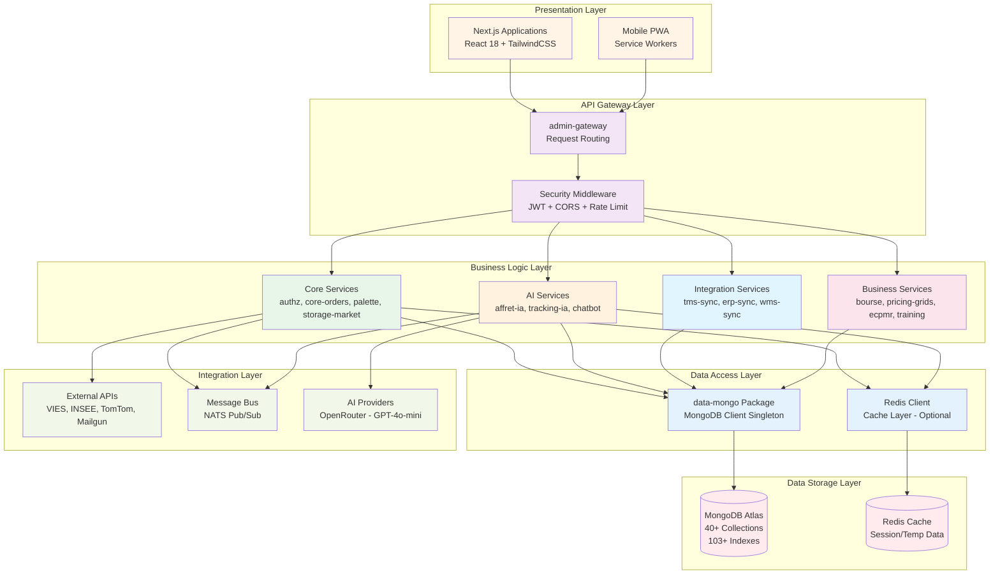

# RT-Technologie - Diagramme d'Architecture UML

## Vue d'ensemble du système

```mermaid
graph TB
    subgraph "Clients/Utilisateurs"
        IND[Industriels]
        TRANS[Transporteurs]
        LOG[Logisticiens]
        FWD[Affréteurs]
        ADM[Administrateurs]
        PUB[Public/Prospects]
    end

    subgraph "Frontend Applications - Vercel Edge"
        WI[web-industry<br/>Port 3010]
        WT[web-transporter<br/>Port 3100]
        WL[web-logistician<br/>Port 3106]
        WF[web-forwarder<br/>Port 4002]
        BA[backoffice-admin<br/>Port 3000]
        MS[marketing-site<br/>Port 3000]
        WR[web-recipient<br/>Port 3102]
        WS[web-supplier<br/>Port 3103]
        MD[mobile-driver<br/>PWA]
        KI[kiosk<br/>Interface]
    end

    subgraph "API Gateway"
        GW[admin-gateway<br/>Port 3000/3008]
    end

    subgraph "Core Services - AWS ECS Fargate"
        AUTH[authz<br/>Port 3002/3007<br/>Auth & Organizations]
        ORDERS[core-orders<br/>Port 3001<br/>Order Management]
        PAL[palette<br/>Port 3009/3011<br/>Pallet Circular Economy]
        STOR[storage-market<br/>Port 3013/3015<br/>Storage Marketplace]
        CHAT[chatbot<br/>Port 3019<br/>Multi-Bot AI Support]
        GEO[geo-tracking<br/>Port 3016<br/>GPS & ETA]
        NOTIF[notifications<br/>Port 3002<br/>Email/SMS/Push]
        PLAN[planning<br/>Port 3004<br/>Route Optimization]
    end

    subgraph "AI Services"
        AFFRET[affret-ia<br/>Port 3005<br/>Carrier Matching AI]
        TRACK[tracking-ia<br/>Port 3015<br/>Delivery Prediction]
    end

    subgraph "Integration Services"
        TMS[tms-sync<br/>Port 3003<br/>TMS Integration]
        ERP[erp-sync<br/>Port 3018<br/>ERP Integration]
        WMS[wms-sync<br/>Port 3017<br/>WMS Integration]
        VIG[vigilance<br/>Port 3006<br/>Carrier Compliance]
    end

    subgraph "Business Services"
        BOURSE[bourse<br/>Port 3016<br/>Freight Exchange]
        PRICE[pricing-grids<br/>Port 3014<br/>Dynamic Pricing]
        ECPMR[ecpmr<br/>Port 3009<br/>Electronic CMR]
        TRAIN[training<br/>Port 3012<br/>E-Learning]
        ONBOARD[client-onboarding<br/>Port 3020<br/>Registration & Signature]
    end

    subgraph "Shared Packages"
        SEC[security<br/>JWT/CORS/Rate Limit]
        MONGO[data-mongo<br/>MongoDB Client]
        ENT[entitlements<br/>Feature Flags]
        NOTCLI[notify-client<br/>Mailgun]
        AICLI[ai-client<br/>OpenRouter]
        VATCLI[vat-client<br/>VIES/INSEE]
        AWS[cloud-aws<br/>S3/SES]
    end

    subgraph "Base de données"
        MDB[(MongoDB Atlas<br/>StagingRT<br/>40+ Collections<br/>103+ Indexes)]
        REDIS[(Redis Cache<br/>Optional)]
    end

    subgraph "Message Bus"
        NATS[NATS Pub/Sub<br/>Event Messaging]
    end

    subgraph "External APIs"
        VIES[VIES API<br/>VAT Verification]
        INSEE[INSEE API<br/>French Companies]
        TOMTOM[TomTom Traffic API<br/>Real-time Traffic]
        MAILGUN[Mailgun<br/>Email Delivery]
        OPENAI[OpenRouter<br/>GPT-4o-mini]
        TEAMS[Microsoft Teams<br/>Support Escalation]
    end

    %% Connexions Utilisateurs → Frontend
    IND --> WI
    TRANS --> WT
    LOG --> WL
    FWD --> WF
    ADM --> BA
    PUB --> MS

    %% Connexions Frontend → Gateway/Services
    WI --> GW
    WT --> GW
    WL --> GW
    WF --> GW
    BA --> GW
    MS --> AUTH
    MS --> ONBOARD

    %% Gateway → Services
    GW --> AUTH
    GW --> ORDERS
    GW --> PAL
    GW --> STOR
    GW --> CHAT
    GW --> GEO
    GW --> NOTIF
    GW --> PLAN
    GW --> BOURSE
    GW --> PRICE
    GW --> ECPMR
    GW --> TRAIN

    %% Service Interactions
    ORDERS --> AFFRET
    ORDERS --> VIG
    ORDERS --> GEO
    ORDERS --> NOTIF
    ORDERS --> TRACK
    PAL --> AICLI
    PAL --> NOTIF
    STOR --> AICLI
    STOR --> WMS
    CHAT --> OPENAI
    CHAT --> TEAMS
    AUTH --> VIES
    AUTH --> INSEE
    ONBOARD --> VIES
    ONBOARD --> INSEE
    GEO --> TOMTOM
    NOTIF --> MAILGUN

    %% Services → Shared Packages
    AUTH --> SEC
    ORDERS --> SEC
    PAL --> SEC
    STOR --> SEC
    AUTH --> MONGO
    ORDERS --> MONGO
    PAL --> MONGO
    STOR --> MONGO
    AUTH --> ENT
    ORDERS --> ENT
    NOTIF --> NOTCLI
    PAL --> AICLI
    STOR --> AICLI
    AUTH --> VATCLI
    ONBOARD --> AWS

    %% Services → Database
    AUTH --> MDB
    ORDERS --> MDB
    PAL --> MDB
    STOR --> MDB
    CHAT --> MDB
    GEO --> MDB
    NOTIF --> MDB
    PLAN --> MDB
    AFFRET --> MDB
    TRACK --> MDB
    VIG --> MDB
    TMS --> MDB
    ERP --> MDB
    BOURSE --> MDB
    PRICE --> MDB
    ECPMR --> MDB
    TRAIN --> MDB

    %% Services → Cache
    AUTH --> REDIS
    ORDERS --> REDIS
    GEO --> REDIS

    %% Services → Message Bus
    ORDERS --> NATS
    PAL --> NATS
    STOR --> NATS
    NOTIF --> NATS
    GEO --> NATS

    %% External APIs
    VATCLI --> VIES
    VATCLI --> INSEE
    NOTCLI --> MAILGUN
    AICLI --> OPENAI

    style IND fill:#e1f5ff
    style TRANS fill:#e1f5ff
    style LOG fill:#e1f5ff
    style FWD fill:#e1f5ff
    style ADM fill:#e1f5ff
    style PUB fill:#e1f5ff

    style WI fill:#fff4e6
    style WT fill:#fff4e6
    style WL fill:#fff4e6
    style WF fill:#fff4e6
    style BA fill:#fff4e6
    style MS fill:#fff4e6

    style GW fill:#f3e5f5

    style AUTH fill:#e8f5e9
    style ORDERS fill:#e8f5e9
    style PAL fill:#e8f5e9
    style STOR fill:#e8f5e9
    style CHAT fill:#e8f5e9
    style GEO fill:#e8f5e9
    style NOTIF fill:#e8f5e9
    style PLAN fill:#e8f5e9

    style AFFRET fill:#fff3e0
    style TRACK fill:#fff3e0

    style MDB fill:#ffebee
    style REDIS fill:#ffebee
    style NATS fill:#e0f2f1
```



## Diagramme de Déploiement UML

```plantuml
@startuml RT-Technologie-Deployment
!define ICONURL https://raw.githubusercontent.com/tupadr3/plantuml-icon-font-sprites/v2.4.0
!include ICONURL/common.puml
!include ICONURL/font-awesome-5/react.puml
!include ICONURL/font-awesome-5/node_js.puml
!include ICONURL/font-awesome-5/database.puml
!include ICONURL/font-awesome-5/docker.puml
!include ICONURL/font-awesome-5/cloud.puml

skinparam componentStyle rectangle
skinparam defaultFontName Arial
skinparam backgroundColor white

cloud "Vercel Edge Network" as VercelCloud {
    node "CDN Global" {
        component "marketing-site" <<Next.js 14>>
        component "web-industry" <<Next.js 14>>
        component "web-transporter" <<Next.js 14>>
        component "web-logistician" <<Next.js 14>>
        component "backoffice-admin" <<Next.js 14>>
    }
}

cloud "AWS Cloud (eu-central-1)" as AWSCloud {
    node "ECS Fargate Cluster: rt-production" {
        rectangle "Core Services" {
            component "authz" <<Node.js 20>> #e8f5e9
            component "core-orders" <<Node.js 20>> #e8f5e9
            component "palette" <<Node.js 20>> #e8f5e9
            component "storage-market" <<Node.js 20>> #e8f5e9
            component "chatbot" <<Node.js 20>> #e8f5e9
            component "geo-tracking" <<Node.js 20>> #e8f5e9
            component "notifications" <<Node.js 20>> #e8f5e9
            component "planning" <<Node.js 20>> #e8f5e9
        }

        rectangle "Integration Services" {
            component "tms-sync" <<Node.js 20>> #fff4e6
            component "erp-sync" <<Node.js 20>> #fff4e6
            component "admin-gateway" <<Node.js 20>> #fff4e6
        }

        rectangle "Business Services" {
            component "training" <<Node.js 20>> #e1f5ff
        }
    }

    rectangle "Container Registry" {
        storage "ECR" <<Docker Images>>
    }
}

cloud "MongoDB Atlas" as MongoCloud {
    database "StagingRT Cluster" {
        storage "rt-technologie DB" {
            folder "40+ Collections"
            folder "103+ Indexes"
        }
    }
}

cloud "External Services" as ExtServices {
    interface "VIES API" as VIES
    interface "INSEE API" as INSEE
    interface "TomTom Traffic API" as TOMTOM
    interface "Mailgun" as MAILGUN
    interface "OpenRouter (GPT-4o)" as OPENAI
    interface "Microsoft Teams" as TEAMS
}

' Connexions Frontend → Backend
"marketing-site" --> authz : HTTPS
"web-industry" --> "admin-gateway" : HTTPS
"web-transporter" --> "admin-gateway" : HTTPS
"web-logistician" --> "admin-gateway" : HTTPS
"backoffice-admin" --> "admin-gateway" : HTTPS

' Gateway → Services
"admin-gateway" --> authz : HTTP
"admin-gateway" --> "core-orders" : HTTP
"admin-gateway" --> palette : HTTP
"admin-gateway" --> "storage-market" : HTTP
"admin-gateway" --> chatbot : HTTP
"admin-gateway" --> "geo-tracking" : HTTP
"admin-gateway" --> notifications : HTTP
"admin-gateway" --> planning : HTTP

' Services → Database
authz --> "rt-technologie DB" : MongoDB Wire Protocol
"core-orders" --> "rt-technologie DB" : MongoDB Wire Protocol
palette --> "rt-technologie DB" : MongoDB Wire Protocol
"storage-market" --> "rt-technologie DB" : MongoDB Wire Protocol
chatbot --> "rt-technologie DB" : MongoDB Wire Protocol
"geo-tracking" --> "rt-technologie DB" : MongoDB Wire Protocol
notifications --> "rt-technologie DB" : MongoDB Wire Protocol
planning --> "rt-technologie DB" : MongoDB Wire Protocol
"tms-sync" --> "rt-technologie DB" : MongoDB Wire Protocol
"erp-sync" --> "rt-technologie DB" : MongoDB Wire Protocol
training --> "rt-technologie DB" : MongoDB Wire Protocol

' Services → External APIs
authz --> VIES : HTTPS
authz --> INSEE : HTTPS
"geo-tracking" --> TOMTOM : HTTPS
notifications --> MAILGUN : HTTPS
chatbot --> OPENAI : HTTPS
chatbot --> TEAMS : Webhook/HTTPS

note right of VercelCloud
    **Frontend Deployment**
    - Framework: Next.js 14
    - Runtime: Edge Runtime
    - CDN: Global distribution
    - SSR + Static Generation
end note

note right of AWSCloud
    **Backend Deployment**
    - Container: Docker
    - Orchestration: ECS Fargate
    - CPU: 256 units
    - Memory: 512 MB
    - Region: eu-central-1
    - Auto-scaling: Enabled
end note

note bottom of MongoCloud
    **Database**
    - Cloud: MongoDB Atlas
    - Cluster: StagingRT
    - Region: eu-central-1
    - Replication: 3 nodes
    - Backup: Daily
end note

@enduml
```

## Diagramme de Composants UML

```plantuml
@startuml RT-Technologie-Components
skinparam componentStyle rectangle
skinparam backgroundColor white

package "Monorepo RT-Technologie" {

    package "apps/ (10 Frontend Applications)" {
        [marketing-site] <<Next.js>>
        [web-industry] <<Next.js>>
        [web-transporter] <<Next.js>>
        [web-logistician] <<Next.js>>
        [web-forwarder] <<Next.js>>
        [web-recipient] <<Next.js>>
        [web-supplier] <<Next.js>>
        [backoffice-admin] <<Next.js>>
        [mobile-driver] <<PWA>>
        [kiosk] <<Next.js>>
    }

    package "services/ (20 Backend Microservices)" {

        package "Core" {
            [authz] <<Auth/IAM>>
            [core-orders] <<Orders>>
            [palette] <<Pallets>>
            [storage-market] <<Marketplace>>
            [chatbot] <<AI Support>>
            [geo-tracking] <<GPS/ETA>>
            [notifications] <<Comm>>
            [planning] <<Optimization>>
        }

        package "AI" {
            [affret-ia] <<Matching>>
            [tracking-ia] <<Prediction>>
        }

        package "Integration" {
            [tms-sync] <<TMS>>
            [erp-sync] <<ERP>>
            [wms-sync] <<WMS>>
            [vigilance] <<Compliance>>
        }

        package "Business" {
            [bourse] <<Exchange>>
            [pricing-grids] <<Pricing>>
            [ecpmr] <<eCMR>>
            [training] <<E-Learning>>
            [client-onboarding] <<Registration>>
            [admin-gateway] <<API Gateway>>
        }
    }

    package "packages/ (17 Shared Libraries)" {

        package "Core Libs" {
            [contracts] <<TypeScript Types>>
            [utils] <<Utilities>>
            [i18n] <<Internationalization>>
        }

        package "Security" {
            [security] <<JWT/CORS/Rate Limit>>
            [authz-pkg] <<Authorization>>
            [entitlements] <<Feature Flags>>
        }

        package "Data Access" {
            [data-mongo] <<MongoDB Client>>
        }

        package "Clients" {
            [notify-client] <<Mailgun>>
            [ai-client] <<OpenRouter>>
            [vat-client] <<VIES/INSEE>>
            [cloud-aws] <<AWS SDK>>
        }

        package "UI/Business" {
            [design-system] <<Components>>
            [chatbot-widget] <<Widget>>
            [onboarding] <<Forms>>
            [pricing] <<Business Logic>>
            [comm-templates] <<Templates>>
        }
    }
}

database "MongoDB Atlas" {
    [rt-technologie DB]
    [40+ Collections]
}

cloud "External Services" {
    [VIES/INSEE API]
    [TomTom Traffic API]
    [Mailgun]
    [OpenRouter]
    [Microsoft Teams]
}

' Frontend ‚Üí Gateway/Auth
[web-industry] --> [admin-gateway]
[web-transporter] --> [admin-gateway]
[web-logistician] --> [admin-gateway]
[backoffice-admin] --> [admin-gateway]
[marketing-site] --> [authz]
[marketing-site] --> [client-onboarding]

' Frontend ‚Üí Shared Packages
[web-industry] ..> [design-system]
[web-industry] ..> [contracts]
[web-transporter] ..> [design-system]
[web-logistician] ..> [design-system]
[web-forwarder] ..> [chatbot-widget]

' Gateway ‚Üí Services
[admin-gateway] --> [authz]
[admin-gateway] --> [core-orders]
[admin-gateway] --> [palette]
[admin-gateway] --> [storage-market]
[admin-gateway] --> [chatbot]
[admin-gateway] --> [geo-tracking]
[admin-gateway] --> [notifications]
[admin-gateway] --> [planning]

' Service Dependencies
[core-orders] --> [affret-ia]
[core-orders] --> [vigilance]
[core-orders] --> [geo-tracking]
[core-orders] --> [notifications]
[core-orders] --> [tracking-ia]
[palette] --> [notifications]
[storage-market] --> [wms-sync]
[chatbot] --> [notifications]
[client-onboarding] --> [authz]

' Services ‚Üí Shared Packages
[authz] ..> [security]
[authz] ..> [data-mongo]
[authz] ..> [vat-client]
[authz] ..> [entitlements]
[core-orders] ..> [security]
[core-orders] ..> [data-mongo]
[core-orders] ..> [entitlements]
[palette] ..> [security]
[palette] ..> [data-mongo]
[palette] ..> [ai-client]
[storage-market] ..> [security]
[storage-market] ..> [data-mongo]
[storage-market] ..> [ai-client]
[chatbot] ..> [ai-client]
[notifications] ..> [notify-client]
[notifications] ..> [comm-templates]
[client-onboarding] ..> [vat-client]
[client-onboarding] ..> [cloud-aws]

' Shared Packages ‚Üí Database
[data-mongo] --> [rt-technologie DB]

' Shared Packages ‚Üí External
[vat-client] --> [VIES/INSEE API]
[ai-client] --> [OpenRouter]
[notify-client] --> [Mailgun]
[cloud-aws] --> [External Services]

' Services ‚Üí Database
[authz] --> [rt-technologie DB]
[core-orders] --> [rt-technologie DB]
[palette] --> [rt-technologie DB]
[storage-market] --> [rt-technologie DB]
[chatbot] --> [rt-technologie DB]
[geo-tracking] --> [rt-technologie DB]
[notifications] --> [rt-technologie DB]
[planning] --> [rt-technologie DB]

' External Services
[geo-tracking] --> [TomTom Traffic API]
[chatbot] --> [Microsoft Teams]

note right of [admin-gateway]
    **API Gateway**
    - Request routing
    - Authentication
    - Rate limiting
    - Request aggregation
end note

note right of [security]
    **Security Package**
    - JWT verification (HS256)
    - CORS middleware
    - Rate limiting (token bucket)
    - Security headers
end note

note right of [entitlements]
    **Feature Flags**
    Plans: FREE, PRO, ENTERPRISE
    Features: VIGILANCE, AFFRET_IA,
    MARKETPLACE, PRICING_GRIDS
end note

note right of [data-mongo]
    **MongoDB Client**
    - Singleton connection
    - Connection pooling
    - Error handling
    - Type-safe queries
end note

@enduml
```



## Architecture en Couches



## Statut de Déploiement

### Backend (AWS ECS Fargate - eu-central-1)
- **Déployés (11/20):** authz, admin-gateway, tms-sync, erp-sync, palette, tracking-ia, planning, notifications, training, geo-tracking, storage-market
- **En attente (9/20):** core-orders, affret-ia, vigilance, ecpmr, bourse, pricing-grids, wms-sync, chatbot, client-onboarding

### Frontend (Vercel Edge Network)
- **Déployés (5/10):** marketing-site, web-industry, web-transporter, web-logistician, backoffice-admin
- **En cours (3/10):** web-recipient, web-supplier, web-forwarder
- **Non démarrés (2/10):** mobile-driver, kiosk

## Technologies Clés

| Catégorie | Technologies |
|-----------|-------------|
| **Frontend** | Next.js 14, React 18, TailwindCSS 3.4, Radix UI, React Query 5.28 |
| **Backend** | Node.js 20, TypeScript 5.4, Express (optionnel), Native HTTP |
| **Base de données** | MongoDB Atlas, Redis |
| **Messaging** | NATS Pub/Sub |
| **Container** | Docker, AWS ECS Fargate |
| **CDN/Edge** | Vercel Edge Network |
| **AI/ML** | OpenRouter (GPT-4o-mini), TomTom Traffic API |
| **Security** | JWT (HS256), Ed25519 signatures, eIDAS |
| **Monitoring** | AWS CloudWatch |

---

**Légende:**
- 🟢 Déployé en production
- 🟡 En cours de développement/déploiement
- 🔴 Non démarré
