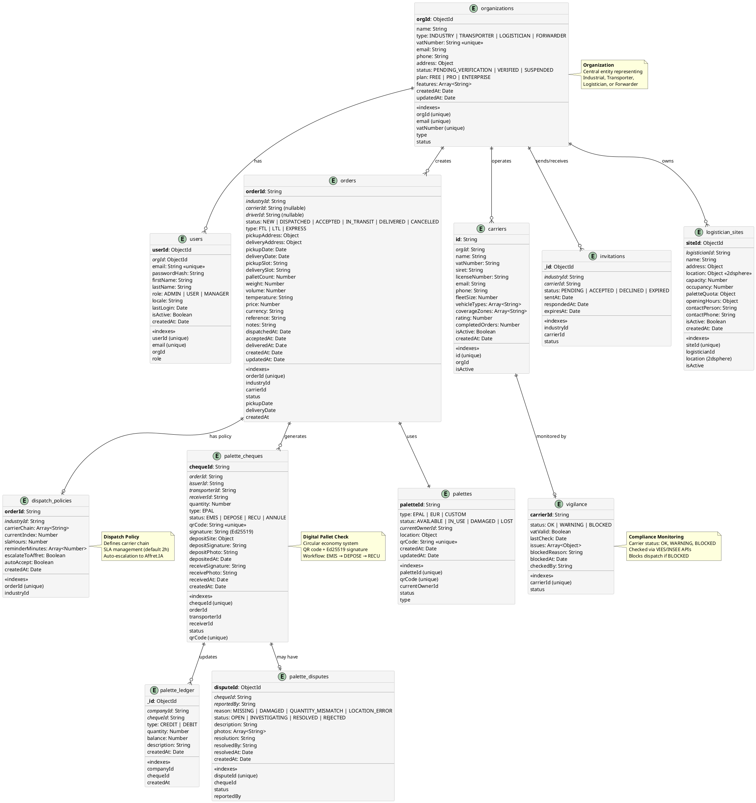
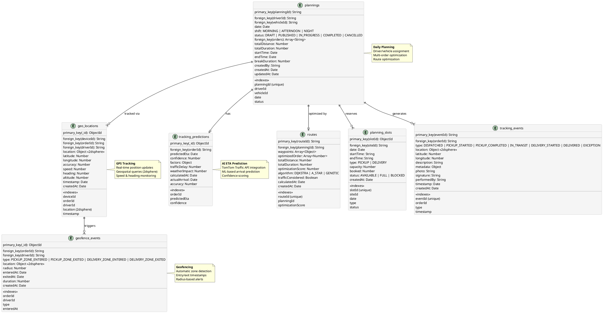
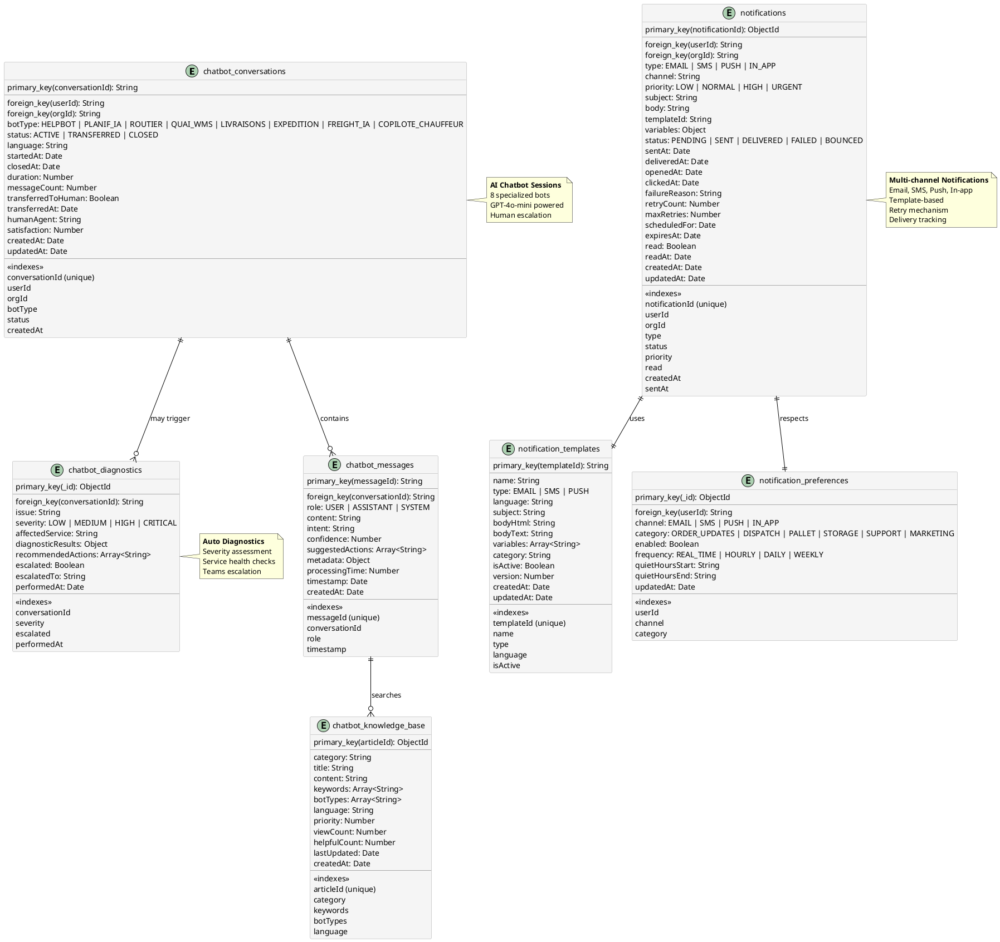
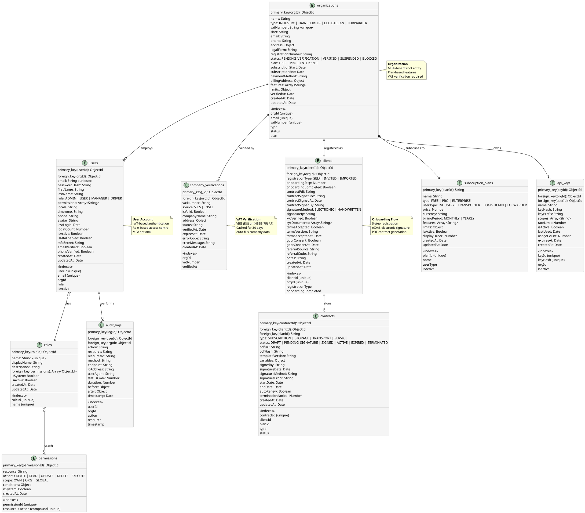

# RT-Technologie - Schéma de Base de Données (ERD)

## Vue d'ensemble

**Base de données:** MongoDB Atlas
**Cluster:** StagingRT
**Database:** rt-technologie
**Collections:** 40+
**Indexes:** 103+

## Diagramme Entité-Relation (ERD) Principal



## ERD - Storage Marketplace

```plantuml
@startuml RT-Technologie-ERD-Storage
skinparam class {
    BackgroundColor WhiteSmoke
    ArrowColor Black
    BorderColor DarkGray
}

entity "storage_needs" as need {
    primary_key(needId): ObjectId
    --
    foreign_key(industrialId): String
    title: String
    description: String
    location: Object <<2dsphere>>
    address: Object
    capacityRequired: Number
    unit: PALLETS | SQM | CBM
    startDate: Date
    endDate: Date
    duration: Number
    temperatureMin: Number
    temperatureMax: Number
    requirements: Object
    budget: Number
    currency: String
    status: DRAFT | PUBLISHED | CONTRACTED | EXPIRED
    visibility: GLOBAL | DIRECT
    invitedLogisticians: Array<String>
    offerCount: Number
    publishedAt: Date
    contractedAt: Date
    createdAt: Date
    updatedAt: Date
    --
    <<indexes>>
    needId (unique)
    industrialId
    status
    location (2dsphere)
    publishedAt
}

entity "storage_offers" as offer {
    primary_key(offerId): ObjectId
    --
    foreign_key(needId): ObjectId
    foreign_key(logisticianId): String
    foreign_key(siteId): String
    price: Number
    priceUnit: PER_PALLET | PER_SQM | PER_CBM
    currency: String
    availableCapacity: Number
    startDate: Date
    description: String
    certifications: Array<String>
    services: Array<String>
    status: SUBMITTED | ACCEPTED | REJECTED | WITHDRAWN
    aiScore: Number
    aiRanking: Number
    submittedAt: Date
    respondedAt: Date
    createdAt: Date
    --
    <<indexes>>
    offerId (unique)
    needId
    logisticianId
    status
    aiRanking
    submittedAt
}

entity "storage_contracts" as contract {
    primary_key(contractId): ObjectId
    --
    foreign_key(needId): ObjectId
    foreign_key(offerId): ObjectId
    foreign_key(industrialId): String
    foreign_key(logisticianId): String
    foreign_key(siteId): String
    startDate: Date
    endDate: Date
    capacity: Number
    price: Number
    paymentTerms: String
    status: ACTIVE | SUSPENDED | TERMINATED | COMPLETED
    contractPdf: String
    signedByIndustrial: Boolean
    signedByLogistician: Boolean
    signedAt: Date
    terminatedAt: Date
    terminationReason: String
    createdAt: Date
    updatedAt: Date
    --
    <<indexes>>
    contractId (unique)
    needId (unique)
    offerId (unique)
    industrialId
    logisticianId
    status
}

entity "wms_inventory" as inventory {
    primary_key(inventoryId): ObjectId
    --
    foreign_key(contractId): ObjectId
    foreign_key(siteId): String
    date: Date
    productSku: String
    productName: String
    quantity: Number
    unit: String
    location: String (zone/aisle/rack)
    batchNumber: String
    expiryDate: Date
    lastMovement: Date
    createdAt: Date
    updatedAt: Date
    --
    <<indexes>>
    inventoryId (unique)
    contractId
    siteId
    productSku
    date
}

entity "wms_movements" as movement {
    primary_key(movementId): ObjectId
    --
    foreign_key(contractId): ObjectId
    foreign_key(siteId): String
    type: IN | OUT | TRANSFER | ADJUSTMENT
    productSku: String
    quantity: Number
    unit: String
    fromLocation: String
    toLocation: String
    reason: String
    reference: String (order/receipt number)
    performedBy: String
    timestamp: Date
    createdAt: Date
    --
    <<indexes>>
    movementId (unique)
    contractId
    siteId
    type
    timestamp
}

' Relationships
need ||--o{ offer : "receives"
offer ||--o| contract : "accepted as"
need ||--|| contract : "becomes"
contract ||--o{ inventory : "tracks"
contract ||--o{ movement : "logs"

note right of need
    **Storage Request**
    Published by industrials
    Visibility: GLOBAL or DIRECT
    AI-powered offer ranking
end note

note right of offer
    **Logistician Offer**
    AI scoring algorithm:
    - Price: 40%
    - Proximity: 25%
    - Reliability: 20%
    - Reactivity: 15%
end note

note right of contract
    **Storage Contract**
    Generated from accepted offer
    Includes digital signatures
    Activates WMS sync
end note

note right of inventory
    **WMS Integration**
    Real-time inventory tracking
    Product-level visibility
    Batch & expiry management
end note

@enduml
```



## ERD - Planning & Geo-Tracking



## ERD - Chatbot & Notifications



## ERD - Authentication & Onboarding



## Collections avec Indexes Géospatiaux

### Collections avec index 2dsphere

| Collection | Champ Géospatial | Usage |
|------------|------------------|-------|
| **storage_listings** | `location` | Recherche de sites de stockage par proximité (Haversine) |
| **storage_needs** | `location` | Matching de besoins avec offres proches |
| **logistician_sites** | `location` | Géolocalisation des entrepôts |
| **transport_offers** | `pickupLocation`, `deliveryLocation` | Recherche de transports par zone |
| **geo_locations** | `location` | Suivi GPS temps réel des véhicules |

### Exemple de requête géospatiale

```javascript
// Trouver tous les sites de stockage dans un rayon de 30km
db.logistician_sites.find({
  location: {
    $near: {
      $geometry: {
        type: "Point",
        coordinates: [2.3522, 48.8566] // Paris
      },
      $maxDistance: 30000 // 30km en mètres
    }
  },
  isActive: true,
  "capacity": { $gte: 100 }
})
```

## Statistiques de la Base de Données

| Métrique | Valeur |
|----------|--------|
| **Collections totales** | 40+ |
| **Indexes totaux** | 103+ |
| **Indexes uniques** | 15+ |
| **Indexes géospatiaux (2dsphere)** | 5 |
| **Indexes composés** | 10+ |
| **Collections avec données seed** | 6 |
| **Taille estimée (prod)** | TBD |

## Conventions de Nommage

1. **IDs primaires**: Suffixe `Id` (ex: `orderId`, `userId`)
2. **Foreign keys**: Préfixe du nom de l'entité + `Id` (ex: `industryId`, `carrierId`)
3. **Timestamps**: `createdAt`, `updatedAt`, `deletedAt`
4. **Statuts**: UPPER_SNAKE_CASE (ex: `PENDING_VERIFICATION`)
5. **Indexes**: Nom explicite avec préfixe de type (ex: `idx_orders_status`, `geo_sites_location`)

## Notes Importantes

1. **MongoDB Atlas** est utilisé avec réplication automatique
2. **Indexes 2dsphere** permettent des requêtes géospatiales performantes
3. **TTL Indexes** pourraient être ajoutés sur `notifications`, `tracking_events` pour l'archivage automatique
4. **Sharding** pourrait être nécessaire sur `orders`, `geo_locations`, `notifications` en production à grande échelle
5. **Backup automatique** quotidien via MongoDB Atlas
