# RT-Technologie - Diagrammes de Flux UML

## Table des Matières
1. [Flux d'Authentification et Onboarding](#flux-dauthentification-et-onboarding)
2. [Flux de Dispatch de Commandes](#flux-de-dispatch-de-commandes)
3. [Flux de Gestion des Palettes (Économie Circulaire)](#flux-de-gestion-des-palettes-économie-circulaire)
4. [Flux du Marketplace de Stockage](#flux-du-marketplace-de-stockage)
5. [Flux de Support Client (Chatbot)](#flux-de-support-client-chatbot)
6. [Flux de Géolocalisation et ETA](#flux-de-géolocalisation-et-eta)

---

## Flux d'Authentification et Onboarding

### Diagramme de Séquence - Inscription Client

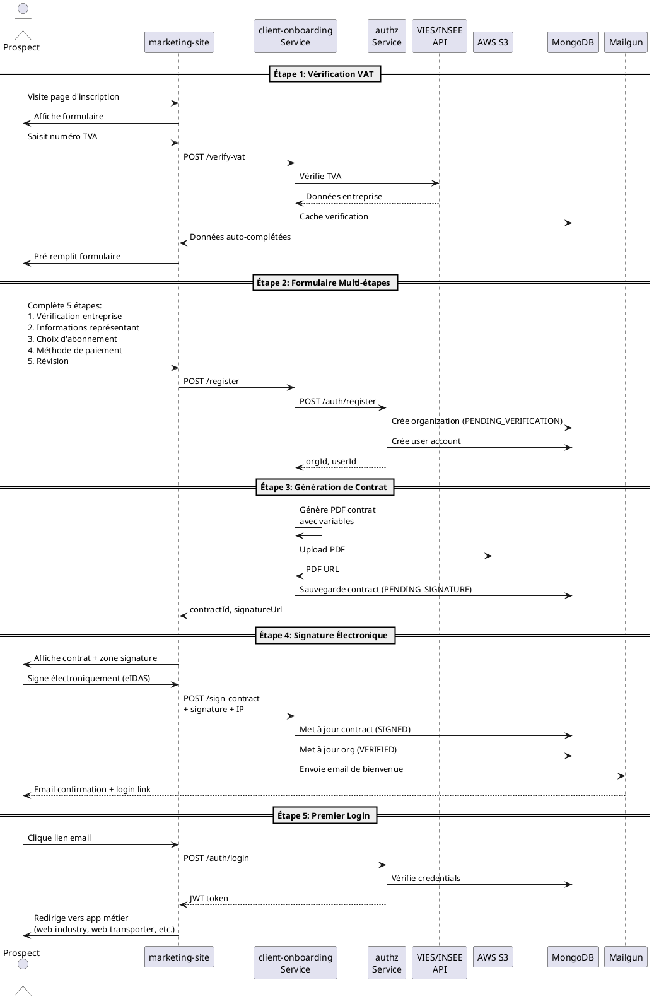

### Diagramme d'Activité - Processus d'Inscription

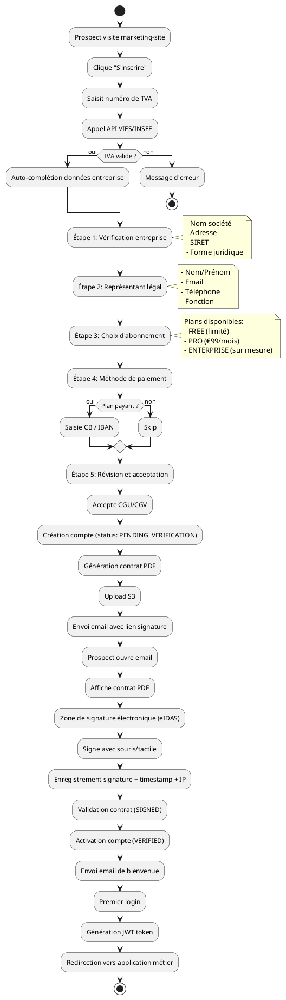

---

## Flux de Dispatch de Commandes

### Diagramme de Séquence - Dispatch avec SLA et Escalade

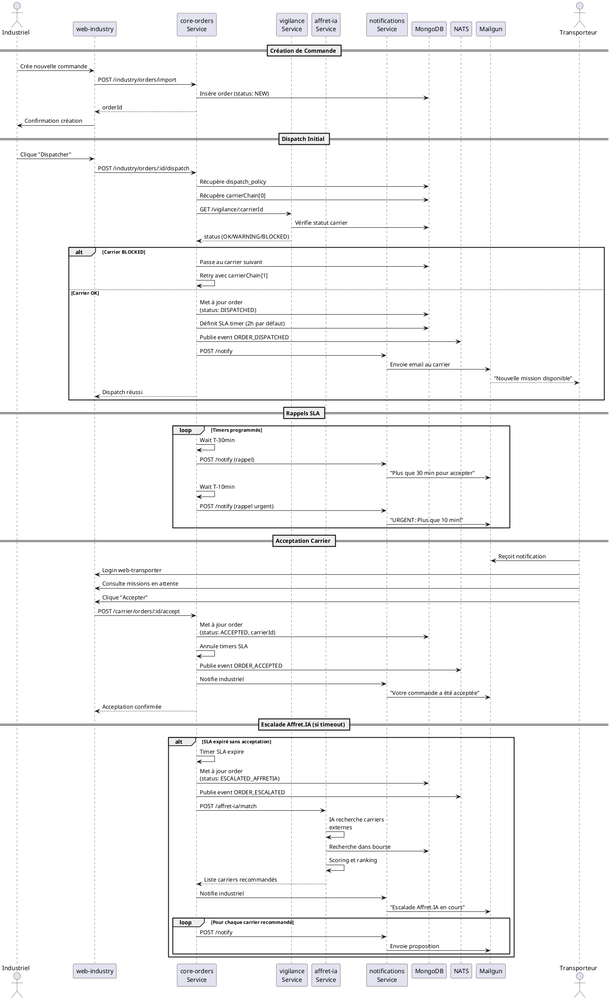

### Diagramme d'Activité - Cycle de Vie Commande

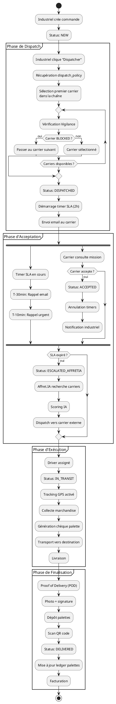

---

## Flux de Gestion des Palettes (Économie Circulaire)

### Diagramme de Séquence - Cycle Complet Palette

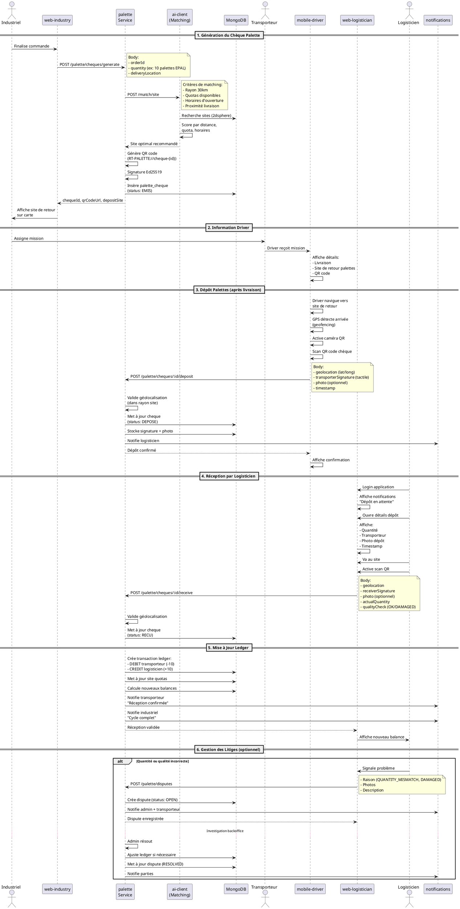

### Diagramme d'Activité - Workflow Palette

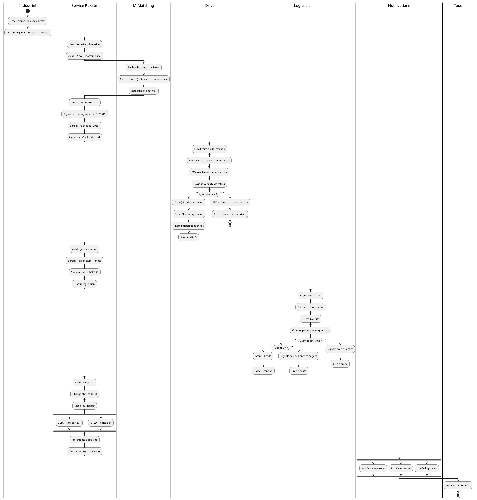

---

## Flux du Marketplace de Stockage

### Diagramme de Séquence - Publication et Acceptation

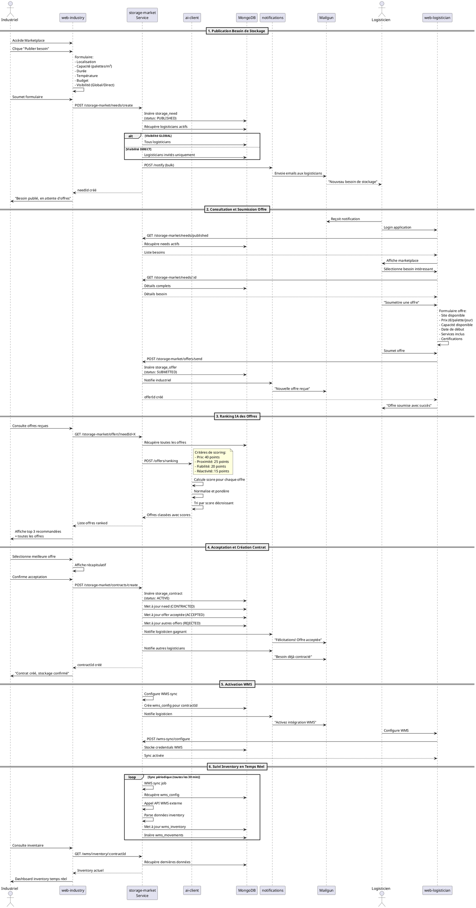

### Diagramme d'Activité - Cycle Marketplace

```plantuml
@startuml RT-Storage-Marketplace-Activity
|Industriel|
start
:Besoin de stockage identifié;
:Accède Marketplace;

partition "Publication" {
  :Remplit formulaire besoin;
  note right
    - Lieu
    - Capacité
    - Durée
    - Température
    - Budget
  end note

  if (Visibilité ?) then (GLOBAL)
    :Tous logisticians notifiés;
  else (DIRECT)
    :Logisticians invités uniquement;
  endif

  :Publication (status: PUBLISHED);
}

|Logisticiens|
partition "Réception et Analyse" {
  :Reçoivent notification email;
  :Consultent besoin;

  fork
    :Logisticien A analyse;
    if (Capacité dispo ?) then (oui)
      :Prépare offre;
    else (non)
      detach
    endif
  fork again
    :Logisticien B analyse;
    if (Capacité dispo ?) then (oui)
      :Prépare offre;
    else (non)
      detach
    endif
  fork again
    :Logisticien C analyse;
    if (Capacité dispo ?) then (oui)
      :Prépare offre;
    else (non)
      detach
    endif
  end fork
}

partition "Soumission Offres" {
  :Logisticiens soumettent offres;
  :Status: SUBMITTED;
  :Notification industriel;
}

|Service IA|
partition "Ranking Intelligence" {
  :Collecte toutes les offres;
  :Calcul score Prix (40%);
  :Calcul score Proximité (25%);
  note right
    Utilise 2dsphere index
    Haversine distance
  end note
  :Calcul score Fiabilité (20%);
  note right
    Basé sur historique
    Taux de satisfaction
  end note
  :Calcul score Réactivité (15%);
  note right
    Temps de réponse
    Disponibilité
  end note

  :Score total = somme pondérée;
  :Tri décroissant par score;
}

|Industriel|
partition "Sélection" {
  :Consulte offres classées;
  :Top 3 mises en avant;
  :Affichage carte + détails;

  :Compare offres;
  :Sélectionne meilleure offre;
  :Confirme acceptation;
}

|Service Storage Market|
partition "Contractualisation" {
  :Crée contrat (ACTIVE);
  :Marque need: CONTRACTED;
  :Marque offre sélectionnée: ACCEPTED;
  :Rejette autres offres;

  fork
    :Notifie gagnant;
  fork again
    :Notifie perdants;
  end fork
}

|Logisticien Gagnant|
partition "Intégration WMS" {
  :Reçoit demande config WMS;
  :Entre credentials API WMS;
  :Test connexion;

  if (Connexion OK ?) then (oui)
    :Active sync automatique;
  else (non)
    :Erreur configuration;
    :Support contacté;
    detach
  endif
}

|Service Storage Market|
partition "Synchronisation Continue" {
  repeat
    :Sync WMS (toutes les 30 min);
    :Récupère inventory;
    :Récupère movements;
    :Met à jour DB;
    :Calcule métriques;
  repeat while (Contrat ACTIVE ?)
}

|Industriel & Logisticien|
:Consultent dashboards;
:Inventory temps réel;
:Mouvements tracés;
:Alertes stocks bas;

:Fin de contrat;
:Status: COMPLETED;

stop

@enduml
```

---

## Flux de Support Client (Chatbot)

### Diagramme de Séquence - Session Chatbot avec Escalade

```plantuml
@startuml RT-Chatbot-Sequence
actor "Utilisateur" as user
participant "App Frontend\n(widget)" as widget
participant "chatbot\nService" as chatbot
participant "ai-client\n(OpenRouter)" as ai
participant "MongoDB" as db
participant "Microsoft Teams" as teams
actor "Support Humain" as support

== 1. Ouverture Session ==
user -> widget: Clique icône chatbot
widget -> chatbot: POST /chatbot/session
note right
  Body:
  - userId
  - orgId
  - botType (ex: HELPBOT)
  - language
end note

chatbot -> db: Crée conversation
chatbot -> db: Charge knowledge base
chatbot --> widget: conversationId, welcomeMessage
widget -> user: Affiche chat + message d'accueil

== 2. Conversation IA ==
user -> widget: Tape question\n"Comment modifier une commande?"
widget -> chatbot: POST /chatbot/message
note right
  Body:
  - conversationId
  - content
  - timestamp
end note

chatbot -> db: Enregistre message (role: USER)
chatbot -> db: Récupère historique conversation
chatbot -> db: Recherche dans knowledge_base
chatbot -> ai: POST to OpenRouter API
note right
  Model: GPT-4o-mini
  Context: historique + knowledge base
  Max tokens: 500
end note

ai -> ai: Traite question
ai -> ai: Génère réponse
ai --> chatbot: Response + confidence score

chatbot -> db: Enregistre réponse (role: ASSISTANT)

alt Confidence haute (>0.8)
  chatbot -> chatbot: Extrait actions suggérées
  chatbot --> widget: Response + suggestedActions
  widget -> user: Affiche réponse + boutons action
else Confidence moyenne (0.5-0.8)
  chatbot --> widget: Response + disclaimer
  widget -> user: "Voici ce que j'ai trouvé...\nSouhaitez-vous parler à un humain?"
else Confidence basse (<0.5)
  chatbot -> chatbot: Déclenche escalade auto
  chatbot -> chatbot: Jump to "Escalade Humaine"
end

== 3. Diagnostics Automatiques ==
user -> widget: "J'ai un problème de connexion"
widget -> chatbot: POST /chatbot/message

chatbot -> chatbot: Détecte intent: TECHNICAL_ISSUE
chatbot -> chatbot: Lance diagnostics
note right
  Checks:
  - API service status
  - User session validity
  - Recent error logs
  - Network connectivity
end note

chatbot -> db: Récupère logs user récents
chatbot -> chatbot: Analyse logs
chatbot -> chatbot: Évalue sévérité

alt Problème identifié
  chatbot -> db: Crée diagnostic record
  chatbot -> chatbot: Génère recommended_actions
  chatbot --> widget: "Problème détecté:\n[description]\n\nActions:\n1. ...\n2. ..."
  widget -> user: Affiche diagnostic + actions
else Problème non identifiable
  chatbot -> chatbot: Escalade nécessaire
end

== 4. Escalade vers Humain ==
user -> widget: "Je veux parler à quelqu'un"
widget -> chatbot: POST /chatbot/transfer-to-human

chatbot -> db: Met à jour conversation\n(transferredToHuman: true)
chatbot -> db: Évalue priorité
note right
  Priority factors:
  - Severity (CRITICAL = 1, LOW = 4)
  - Customer plan (ENTERPRISE prioritaire)
  - Issue type
  - Waiting time
end note

chatbot -> teams: POST Webhook
note right
  Adaptive Card:
  - User info
  - Conversation history
  - Issue summary
  - Priority level
  - Quick actions
end note

teams --> support: Notification carte Teams
chatbot --> widget: "Transfert en cours...\nUn agent va vous répondre"

== 5. Prise en Charge Humaine ==
support -> teams: Consulte carte
support -> teams: Clique "Prendre en charge"
teams -> chatbot: POST /chatbot/assign-agent
chatbot -> db: Met à jour conversation\n(humanAgent: supportId)
chatbot --> widget: "Agent [Nom] a rejoint"

support -> teams: Tape réponse
teams -> chatbot: POST /chatbot/message (agent)
chatbot -> db: Enregistre (role: ASSISTANT, human: true)
chatbot --> widget: Push message via WebSocket
widget -> user: Affiche message agent

user -> widget: Répond à l'agent
widget -> chatbot: POST /chatbot/message
chatbot -> db: Enregistre message
chatbot -> teams: Push to Teams
teams -> support: Notification + message

== 6. Résolution et Clôture ==
support -> teams: "Problème résolu"
support -> teams: Demande évaluation satisfaction
teams -> chatbot: POST /chatbot/request-feedback

chatbot --> widget: "Votre problème est-il résolu?"
widget -> user: Boutons: "Oui" / "Non"

user -> widget: Clique "Oui"
widget -> chatbot: POST /chatbot/feedback

chatbot -> db: Met à jour conversation:\n- satisfaction: 5/5\n- status: CLOSED

chatbot -> db: Enregistre métriques
note right
  Metrics:
  - Resolution time
  - Message count
  - Transfer needed
  - Satisfaction score
end note

chatbot --> widget: "Merci! À bientôt."
widget -> user: Ferme chat

@enduml
```

---

## Flux de Géolocalisation et ETA

### Diagramme de Séquence - Tracking GPS et Calcul ETA

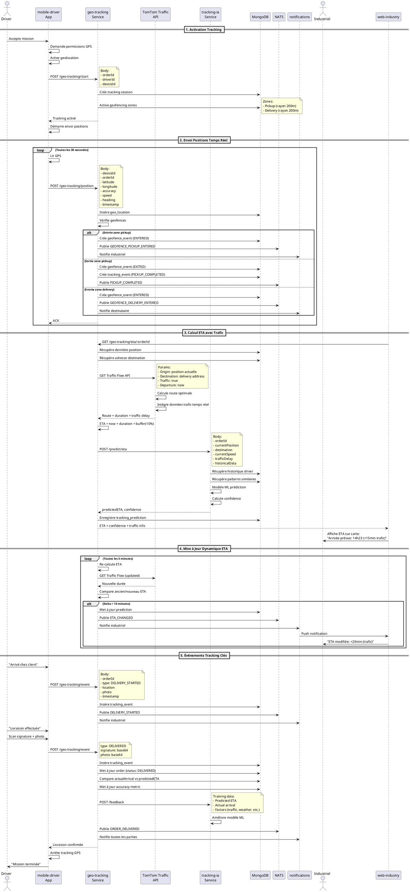

---

## Diagrammes Complémentaires

### Diagramme d'États - Cycle de Vie Commande

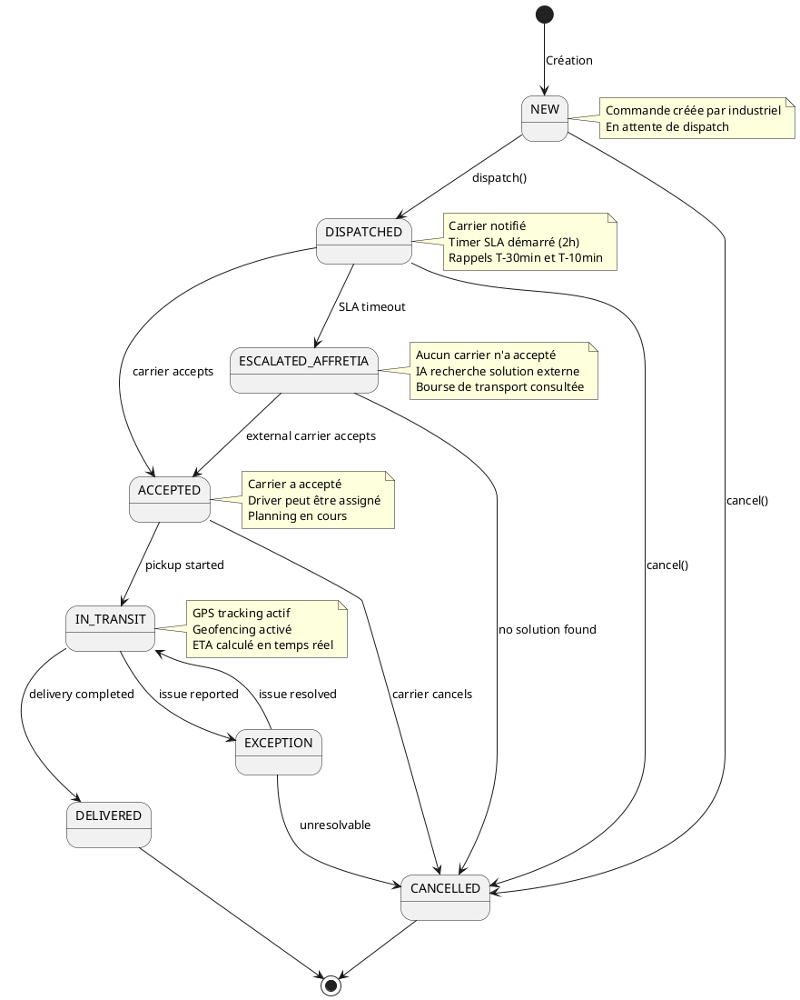

### Diagramme de Composants - Architecture Microservices

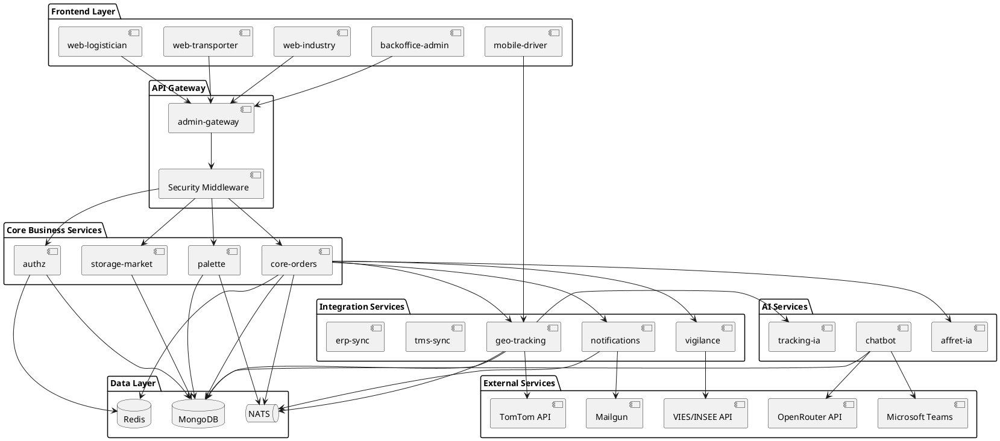

---

## Conclusion

Ces diagrammes UML couvrent les principaux flux métier de la plateforme RT-Technologie:

1. **Authentication & Onboarding** - Inscription sécurisée avec vérification VAT et signature électronique
2. **Order Dispatch** - Dispatch intelligent avec SLA, rappels automatiques et escalade IA
3. **Palette Management** - Économie circulaire avec QR codes, signatures cryptographiques et ledger
4. **Storage Marketplace** - Marketplace avec ranking IA et intégration WMS temps réel
5. **Chatbot Support** - Support client multi-bot avec diagnostics auto et escalade humaine
6. **Geo-tracking & ETA** - Tracking GPS temps réel avec calcul ETA intégrant le trafic

Tous ces flux sont interconnectés via:
- **NATS** pour la messagerie asynchrone
- **MongoDB** pour le stockage persistant
- **Redis** pour le cache et sessions
- **APIs externes** pour l'enrichissement de données

La plateforme démontre une architecture microservices moderne avec intelligence artificielle intégrée.
